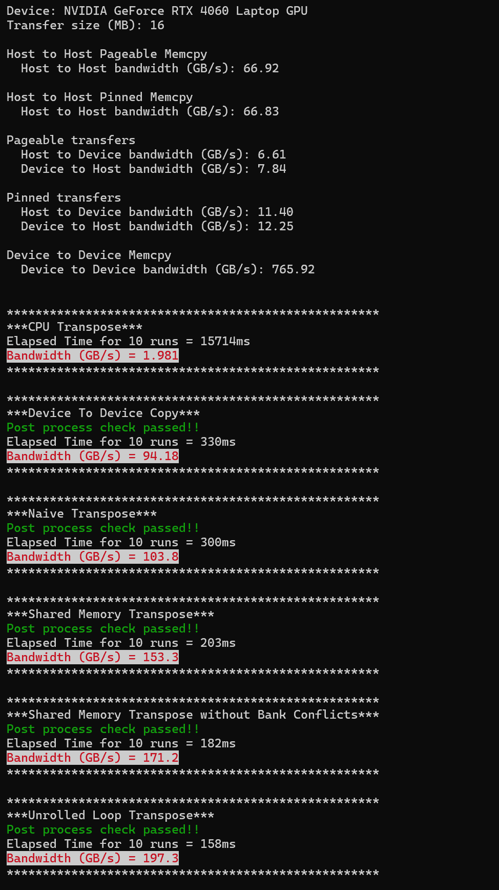
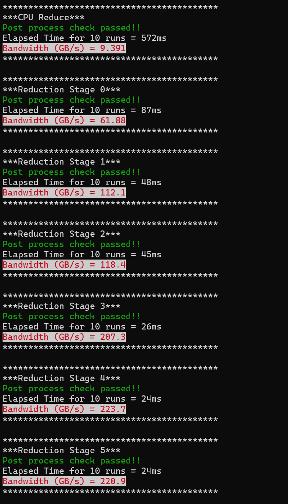

# CIS 565 Performance Lab

This is the second in series of 2 labs for CUDA. In this lab, we will discuss how NVIDIA's Nsight tools can aid in profiling CUDA programs.

**The performance lab will be held in class. Please bring your Windows CUDA-Capable laptop with the code downloaded and built. If you do not have a Windows CUDA-Capable laptop, please find a partner to work with.** You will be able to follow the steps with Linux as well, but we will show this with Windows in the class.

# Before Performance Lab

## Clone, Build and Run

The source code consists of a CMake build structure similar to [Project 0](https://github.com/CIS565-Fall-2022/Project0-CUDA-Getting-Started).
Clone this repository from Github and then run the instructions below.

1. From the `Performance-Lab` directory, run:
    * Windows: `cmake -B build -S . -G "Visual Studio 17 2022" -A x64` to generate the Visual Studio project. You may choose a different Visual Studio version.
    * Linux: `cmake -B build -S . -G "Unix Makefiles" -DCMAKE_BUILD_TYPE=Debug` to generate the makefiles.
2. Open the generated `PerformanceLab.sln` project from the `build` directory.
3. Build the project in Visual Studio. (Note that there are Debug and Release configuration options.)
4. Run. Make sure you run the `transpose` target (not `ALL_BUILD`) by right-clicking it and selecting "Set as StartUp Project".

### Note:

* If you start running using `F5`, the command prompt will open and close.
    * The `F5` shortcut is *Start Debugging*, which means Visual Studio will
      monitoring your application and it will not run at full performance.
    * Use `F5` only when you are debugging.
* Instead, use `Ctrl+F5` when you want to run without debugging. This will run
  the application at full performance as well as keep the command prompt open
  after the application ends.

Please ask me or the TAs ahead of time if you have trouble compiling the code. We want to be ready to go at the start of the lab.

## Transpose

- Complete Copy Kernel, 
- Naive Transpose
- Shared Memory Transpose
- W/O Bank Conflicts Transpose

In the interest of time, we will not be writing code from scratch of these during the lab. So it is in your best interest to complete the code before the lab.
   -  This will let you review how transpose with shared memory works. So when we write more advance kernel that build on these, you will know what changes we are making.

The sections you need to work on are marked by `TODO: COMPLETE THIS`.

- There are 3 kernels you need to write, and 3 `blocks`/`grids` configurations you need to set up.
- Once completed, your output should look like this: 

  

#### Third Party Code

This repository includes code from [termcolor](https://github.com/ikalnytskyi/termcolor) licensed under the BSD 3 Clause.

## Reduce

0. Naive Reduction
1. Less Warp Divergence
2. Less Bank Conflicts
3. Less Blocks and  More Computation
4. Warp Level Unroll Loop (No Warp Divergence)
5. Block and Shared Mem Unroll Loop

  

