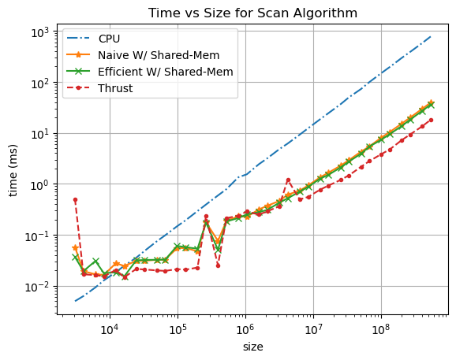
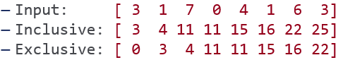
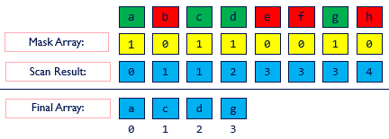

CUDA Stream Compaction
======================

**University of Pennsylvania, CIS 565: GPU Programming and Architecture, Project 2**

* Runze Wang
* Tested on: Windows 22, VS2019, CUDA12.2, RTX4060

This project is the CUDA implementation of Prefix-Sum (Scan) algorithm and Stream Compaction algorithm. The later algorithm is based the former one.

<p align="center">
  
</p>

## Introduction

### Scan

The all-prefix-sums operation, known as **scan**, takes a binary associative operator $\bigoplus$ with identity $I$, and an array of $n$ elements. The result of the all-prefix-sums operation is an array of $n$ elements, typically presented in two versions: the *inclusive scan* and the *exclusive scan*.

- **Input:** $[a_0,a_1,...,a_{n-1}]$

- **Output:**

  - **Inclusive:** $[a_0,(a_0\bigoplus a_1),...,(a_0\bigoplus a_1\bigoplus...\bigoplus a_{n-1}) ]$

  - **Exclusive:** $[I,a_0,(a_0\bigoplus a_1),...,(a_0\bigoplus a_1\bigoplus...\bigoplus a_{n-2}) ]$

An exclusive scan can be generated from an inclusive scan by shifting the resulting array right by one element and inserting the identity. 

**Example:**  Add Operation

<p align="center">
  
</p>

### Stream Compact

Informally, **stream compaction** is a filtering operation: from an input vector, it selects a subset of this vector and packs that subset into a dense output vector. The applications of  stream compaction include collision detection and sparse matrix compression. 

The overview of the pipeline is as follows:

1. **Selection and Masking**:  select the elements of interest and mask them with 1.

2. **Inclusive Scan**: perform an inclusive scan on the mask array, resulting in an index array for the output.

3. **Output Assignment**: the output array is populated according to the generated index array.

   ```c++
   if(mask[i]==1)
     output[index[i]]=input[i];
   ```

<p align="center">

</p>
## CUDA Acceleration

The project mainly focus on the acceleration of scan algorithm by some parallel algorithms and takes the advantage of the CUDA Architecture. So the highlights of the project are as follow:

- A naive parallel scan algorithm (Hillis and Steele, 1986) taking $O(n \log n)$ addition operations. **Ping-pong buffers** are used to avoid race conditions.
- A work-efficient parallel scan algorithm (Blelloch, 1990) taking $O(n)$ addition operations. CUDA implementation takes **warp divergence** in consideration.
- Divide & conquer algorithm for **arbitrary sized** input arrays.
- Taking advantage of **shared memory** in CUDA and avoiding **bank-conflicts**.

More details you can see in [INSTRUCTION](./INSTRUCTION.md) and [GPU Gem Ch 39](https://developer.nvidia.com/gpugems/GPUGems3/gpugems3_ch39.html).

### Naive parallel scan algorithm

```c
// Algorithm1: Hillis and Steele Scan 
for d = 0 to log2(n)-1:
  stride = 1<<d;
  for all k in parallel:
    if (k >= stride)
      x[k] = x[k – stride] + x[k];
  end for
end for
```

<p align="center">

</p>

In implementation of CUDA, not all threads run simultaneously for arrays larger than the warp size. *Algorithm 1* will not work, because it performs the scan in place on the array. Instead, we can create two device arrays and swap them at each iteration to avoid race conditions. (Just like ping-pong buffers)

The result of naive parallel scan is the inclusive scan. And it's available to use in arbitrary sized array (non-power-of-two).

The problem with *Algorithm 1* is apparent if we examine its work complexity. The algorithm performs $O(n \log n)$ addition operations.
$$
\sum_{d=1}^{\log n} n-2^{d-1} = O(n\log n - n)=O(n\log n)
$$

#### Work-Efficient Parallel Scan

To address the work-inefficiency in  *Algorithm 1*, 
