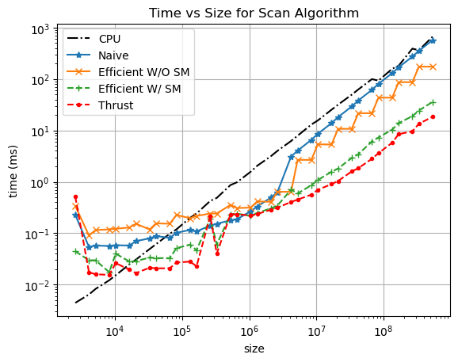
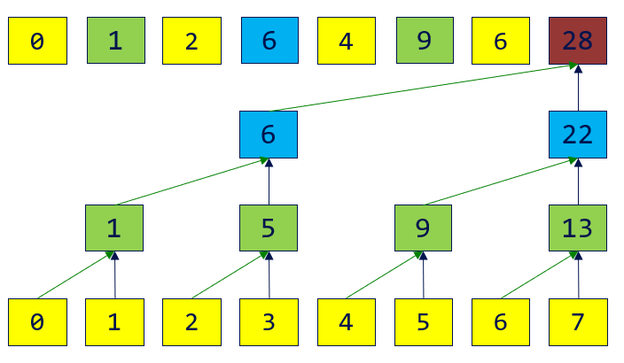
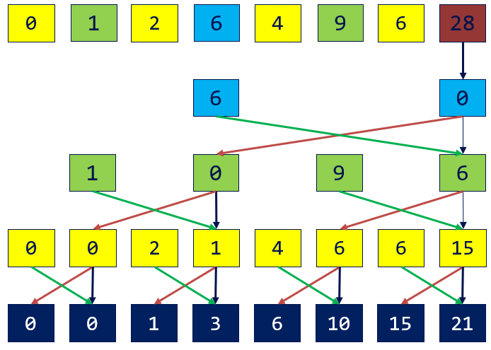
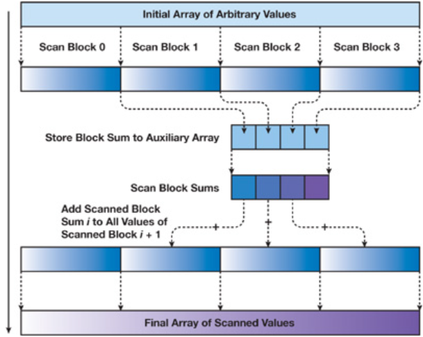
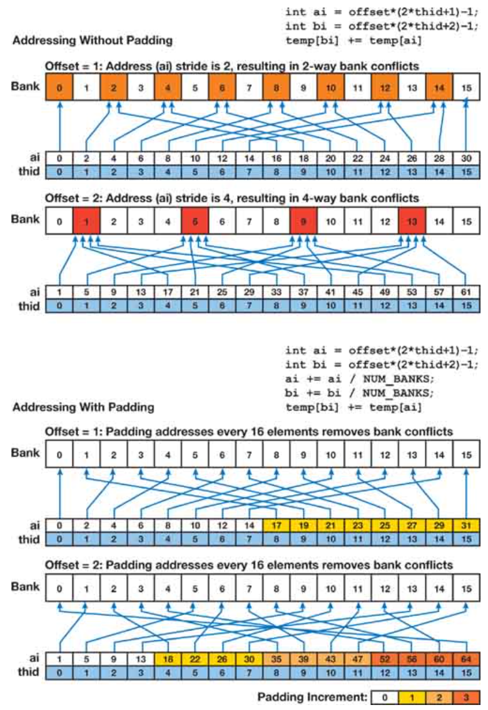
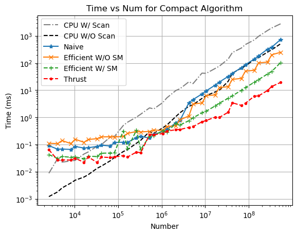
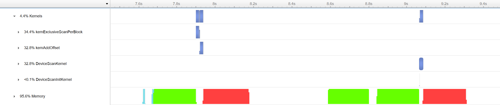

CUDA Stream Compaction
======================

**University of Pennsylvania, CIS 565: GPU Programming and Architecture, Project 2**

* Runze Wang
* Tested on: Windows 22, VS2019, CUDA12.2, RTX4060

This project is the CUDA implementation of Prefix-Sum (Scan) algorithm and Stream Compaction algorithm. The later algorithm is based the former one.

<p align="center">
  
</p>

## Introduction

### 1. Scan

The all-prefix-sums operation, known as **scan**, takes a binary associative operator $\bigoplus$ with identity $I$, and an array of $n$ elements. The result of the all-prefix-sums operation is an array of $n$ elements, typically presented in two versions: the *inclusive scan* and the *exclusive scan*.

- **Input:** $[a_0,a_1,...,a_{n-1}]$

- **Output:**

  - **Inclusive:** $[a_0,(a_0\bigoplus a_1),...,(a_0\bigoplus a_1\bigoplus...\bigoplus a_{n-1}) ]$

  - **Exclusive:** $[I,a_0,(a_0\bigoplus a_1),...,(a_0\bigoplus a_1\bigoplus...\bigoplus a_{n-2}) ]$

An exclusive scan can be generated from an inclusive scan by shifting the resulting array right by one element and inserting the identity. 

**Example:**  Add Operation

<p align="center">
  
</p>


### 2. Stream Compact

Informally, **stream compaction** is a filtering operation: from an input vector, it selects a subset of this vector and packs that subset into a dense output vector. The applications of  stream compaction include collision detection and sparse matrix compression. 

The overview of the pipeline is as follows:

1. **Selection and Masking**:  select the elements of interest and mask them with 1.

2. **Inclusive Scan**: perform an inclusive scan on the mask array, resulting in an index array for the output.

3. **Output Assignment**: the output array is populated according to the generated index array.

   ```c++
   if(mask[i]==1) output[index[i]]=input[i];
   ```

<p align="center">

</p>

## CUDA Acceleration

The project mainly focus on the acceleration of **scan** by some parallel algorithms and takes the advantage of the CUDA Architecture. So the features of the project are as follow. :laughing: 

:star: A naive parallel scan algorithm (Hillis and Steele, 1986) taking $O(n \log n)$ addition operations. **Ping-pong buffers** are used to avoid race conditions.

:star: A work-efficient parallel scan algorithm (Blelloch, 1990) taking $O(n)$ addition operations. CUDA implementation takes **warp divergence** in consideration.

:star: ​Divide & Conquer strategy for **arbitrary sized** input arrays.

:star: ​Taking advantage of **shared memory** in CUDA and avoiding **bank-conflicts**.

More details you can see in [INSTRUCTION](./INSTRUCTION.md) and [GPU Gem Ch 39](https://developer.nvidia.com/gpugems/GPUGems3/gpugems3_ch39.html).

### 1. Naive parallel scan algorithm

```c
// Algorithm1: Hillis and Steele Scan 
for d = 0 to log2(n)-1:
  stride = 1<<d;
  for all k in parallel:
    if (k >= stride)
      x[k] = x[k – stride] + x[k];
  end for
end for
```

<p align="center">

</p>

> **Notice:** in implementation of CUDA, not all threads run simultaneously for arrays larger than the warp size. *Algorithm 1* will not work, because it performs the scan in place on the array. Instead, we can create two device arrays and swap them at each iteration to avoid race conditions. (Just like **ping-pong buffers**)

The result of naive parallel scan is the *inclusive scan*. And it's available to use in arbitrary sized array (non-power-of-two).

The problem with *Algorithm 1* is apparent if we examine its work complexity. The algorithm performs $O(n \log n)$ addition operations. At every level, all threads cost $O(n)$ workload.

$$
\sum_{d=1}^{\log n} n-2^{d-1} = O(n\log n - n)=O(n\log n)
$$

### 2. Work-Efficient Parallel Scan

To address the work-inefficiency in  *Algorithm 1*, we need to develop a work-efficient scan algorithm for CUDA that avoids the extra factor of $\log n$ work performed by the naive algorithm. This algorithm is based on the one presented by Blelloch (1990). The idea is to build a balanced binary tree on the input data and sweep it to and from the root to compute the prefix sum. Briefly, the algorithm consists of two phases: the *reduce phase* (also known as the *up-sweep phase*) and the *down-sweep phase* . And we assume the size of input array is power of two ($2^d$) .

#### Up-Sweep (Reduce) Phase

In the reduce phase, we traverse the tree from leaves to root computing partial sums at internal nodes of the tree, as shown in figure below. This is also known as a parallel reduction.

<p align="center">
    
</p>

```c++
// Algorithm 2: parallel reduction
for d = 0 to log2(n) - 1
  s = 1<<d;
  for all k in parallel:
	if (k < n/(s*2))
    	l = s * (2*k + 1) - 1;
		r = s * (2*k + 2) - 1;
		x[r] += x[l];
	end if
  end for
end for
```

> **Notice:** we don't use `(k+1) % (s*2) == 0` as the selection condition because it causes **warp divergence**. This means that while some threads are computing, others are left waiting within the same warp.

#### Down-Sweep Phase

In the down-sweep phase, we traverse back down the tree from the root, using the partial sums from the reduce phase to build the scan in place on the array. 

We start by inserting zero at the root of the tree, then at each level:

- Left child: **Copy** the parent value

- Right child: **Add** the parent value and left child value copying root value.

<p align="center">
    
</p>

```c++
// Algorithm 2: parallel down-sweep
for d = log2(n) - 1 to 0
  s = 1<<d;
  for all k in parallel:
	if (k < n/(s*2))
    	l = s * (2*k + 1) - 1;
		r = s * (2*k + 2) - 1;
		t = x[r];
		x[r] += x[l];
		x[l] = t;
	end if
  end for
end for
```

The result of a naive parallel scan is the *exclusive scan*. Both phases have an $O(n)$ workload, making it a work-efficient parallel scan algorithm. Furthermore, all operations can be performed in place, avoiding the race conditions that are inherent in the naive method. Additionally, the total number of threads is only half the size of the array.

However, *Algorithm 2* is limited to use in  power-of-two sized array. One way to handle arbitrary sized arrays is by padding the array with the identity element, making its size compatible with *Algorithm 2*. In the worst case, for example when the size is $2^d+1$, the array must be extended to $2^{d+1}$, doubling the computational cost. As a result, the amount of wasted computation is $O(n)$.

### 4. Hardware Optimization

#### Divide & Conquer

In order to scan large arrays of arbitrary (non-power-of-two) dimensions, we take *divide & conquer* strategy to avoid double cost mentioned above.

The basic idea is simple. We divide the large array into blocks that each can be scanned by a single thread block, and then we scan the blocks and write the total sum of each block to another array of block sums. We then scan the block sums, generating an array of block increments that that are added to all elements in their respective blocks.

<p align="center">

</p>

In more detail, let *N* be the number of elements in the input array, and *B* be the number of elements processed in a block. We allocate *N*/*B* thread blocks of *B*/2 threads each. We use the scan algorithm of the previous sections to scan each block `i` independently, storing the resulting scans to sequential locations of the output array. We make one minor modification to the scan algorithm. Before zeroing the last element of block `i` , we store the value to an auxiliary array `SUMS`. We then scan `SUMS` in the same manner, writing the result to an array `INCR`. We then add `INCR[i]` to all elements of block `i` using a simple uniform add kernel invoked on *N*/*B* thread blocks of *B*/2 threads each. 

If the size of the auxiliary array `SUMS` is larger than the block's size *B*, we can apply the *divide and conquer* approach again for `SUMS` recursively. In the worst case, the amount of wasted computation is $\frac{B}{\log B}O(\log n)$, where *B* is typically a constant value.

#### Shared Memory

*Algorithm 1* and *Algorithm 2* are both implemented by CUDA global memory, but it's unavoidable to stride through global memory, which makes coalescing impossible. We can handle this problem by using a type of CUDA memory called *shared memory*.

Because shared memory is on-chip, it is much faster than local and global memory. In fact, shared memory latency is roughly 100X lower than uncached global memory latency. Threads can access data in shared memory loaded from global memory by other threads within the same thread block to facilitate global memory coalescing in cases where it would otherwise not be possible.

According to the *divide and conquer* strategy, we can load data from global memory to shared memory per block, and then apply *Algorithm 2* on the shared memory data.

```c++
__global__ void kernExclusiveScanPerBlock(uint32_t n, int* data, const int* idata){
    uint32_t tid = threadIdx.x;
    uint32_t tid2 = tid*2;
    uint32_t base = blockIdx.x * BLOCK_SIZE;// blockDim.x = BLOCK_SIZE/2
    __shared__ int buffer[BLOCK_SIZE];

    // Load the data to the shared memory
	uint32_t gid = base + tid2;
    buffer[tid2] = (0 < gid && gid < n) ? idata[gid-1] : 0;
    gid = base + tid2 + 1;
    buffer[tid2+1] = (0 < gid && gid < n) ? idata[gid-1] : 0;
    __syncthreads();
    
    // Up-Sweep (Reduce)
    int offset = 1;
    for(int stride = BLOCK_SIZE/2; stride > 0; stride >>= 1){
        if(tid < stride){
            int ai = offset * (tid2 + 1) - 1;
            int bi = offset * (tid2 + 2) - 1;
            ai += CONFLICT_FREE_OFFSET(ai);
            bi += CONFLICT_FREE_OFFSET(bi);
            buffer[bi] += buffer[ai];
        }
        offset <<= 1;
        __syncthreads();
    }

	// Set last element as Identity
    int sum = 0;
    if(tid == blockDim.x - 1){
        sum = buffer[BLOCK_SIZE - 1];
        buffer[BLOCK_SIZE - 1] = 0;
    }
    __syncthreads();
    
    // Down-Sweep (Distribute)
    offset = BLOCK_SIZE/2;
    for(int stride = 1; stride <= BLOCK_SIZE/2; stride <<= 1){
        if(tid < stride){
            int ai = offset * (tid2 + 1) - 1;
            int bi = offset * (tid2 + 2) - 1;
            int t = buffer[ai];
            buffer[ai] = buffer[bi];
            buffer[bi] += t;
        }
        offset >>= 1;
        __syncthreads();

    }
    // Write the result to the output
    gid = base + tid2;
    odata[gid] = buffer[tid2+1];
    gid = base + tid2 + 1;
    odata[gid] = (tid2 + 2 < BLOCK_SIZE) ? buffer[tid2+2] : sum;
}
```

####  Avoiding Bank Conflicts

The scan algorithm of the previous section performs approximately as much work as an optimal sequential algorithm. Despite this work-efficiency, it is not yet efficient on NVIDIA GPU hardware, due to its memory access patterns.

As described in the *[NVIDIA CUDA Programming Guide](https://docs.nvidia.com/cuda/cuda-c-programming-guide/index.html?highlight=Bank%2520Conflicts#shared-memory-5-x)*, the shared memory exploited by this scan algorithm is made up of multiple banks. When multiple threads in the same warp access the same bank, a bank conflict occurs unless all threads of the warp access the same address within the same 32-bit word. The number of threads that access a single bank is called the *degree* of the bank conflict. Bank conflicts cause serialization of the multiple accesses to the memory bank, so that a shared memory access with a degree-*n* bank conflict requires *n* times as many cycles to process as an access with no conflict.

Binary tree algorithms such as our work-efficient scan double the stride between memory accesses at each level of the tree, simultaneously doubling the number of threads that access the same bank. For deep trees, as we approach the middle levels of the tree, the degree of the bank conflicts increases, and then it decreases again near the root, where the number of active threads decreases.

Bank conflicts are avoidable in most CUDA computations if care is taken when accessing `__shared__` memory arrays. We can avoid most bank conflicts in scan by adding a variable amount of padding to each shared memory array index we compute. Specifically, we add to the index the value of the index divided by the number of shared memory banks.

```c++
#define NUM_BANKS 32
#define LOG_NUM_BANKS 5
#define CONFLICT_FREE_OFFSET(n) ((n) >> LOG_NUM_BANKS)
// static shared memory alloc
__shared__ int buffer[BLOCK_SIZE+BLOCK_SIZE/NUM_BANKS];
// all indices to access shared memory
ai += CONFLICT_FREE_OFFSET(ai);
bi += CONFLICT_FREE_OFFSET(bi);
```

<p align="center">

</p>

## Performance Analysis

After testing different block sizes, we set `BLOCK_SIZE=512` as best one.

Comparing all optimization methods for *Scan* and *Stream Compaction* with different array sizes, we measure the time cost

- use `std::chrono` to provide CPU high-precision timing and CUDA event to measure the CUDA performance.
- For CPU, put CPU code between `timer().startCpuTimer()` and `timer().endCpuTimer()`.
- For GPU, put code between `timer().startGpuTimer()` and `timer().endGpuTimer()`. Be sure **not** to include any *initial/final* memory operations (`cudaMalloc`, `cudaMemcpy`) in performance measurements, for comparability.

We also use CUDA thrust library function `thrust::exclusive_scan(first, last, result)` as baseline.

### Scan

<p align="center">

</p>
The size of data contains power-of-two ($[2^{12},2^{13},...,2^{29}]$)  and non-power-of-two ($\frac{5}{8}*[2^{12},2^{13},...,2^{29}]$).

It is evident that the *Work-Efficient* method performs better than the *Naive* method. However, it faces challenges when dealing with non-power-of-two (NPOT) data. By employing the *divide and conquer* strategy and applying it in Shared Memory (SM), the results are comparable to the baseline implementation provided by the `thrust` library.

### Stream Compaction

<p align="center">

</p>
### NSight Analysis for Scan

If we compare *scan* in CPU, GPU Work-Efficient and Thrust implement, we can see results bellow:

```txt
==== cpu scan, power-of-two ====
   elapsed time: 786.001ms    (std::chrono Measured)
    [   0   9  48  96 137 169 205 219 255 267 312 322 368 ... 263704909 263704920 ]
==== work-efficient scan, power-of-two, on Shared Memory ====
   elapsed time: 36.0336ms    (CUDA Measured)
    [   0   9  48  96 137 169 205 219 255 267 312 322 368 ... 263704909 263704920 ]
    passed
==== thrust scan, power-of-two ====
   elapsed time: 18.6464ms    (CUDA Measured)
    passed
```

The GPU versions both accelerate the CPU *scan*. However, our work-efficient method still slower than `thrust::exclusive_scan`. So we need to analysis GPU performance details by NSight.

<p align="center">

</p>

The bottom row of the visualization represents the CUDA usage, where green indicates data copying from the host to the device, red represents data copying from the device to the host, and blue represents the time when the kernel is running. It is noticeable that the green and red data usage is approximately equal since data needs to be transferred to and from the GPU. 

However, our method takes about double the time in kernels compared to Thrust. This is primarily due to the additional time spent on adding `InCR[i]` to each block through global memory, which is the main factor contributing to the increased time cost. :thinking:

## Reference

- [GPU Gem Ch 39](https://developer.nvidia.com/gpugems/GPUGems3/gpugems3_ch39.html)

- [CIS565-Fall-2023/Project2-Stream-Compaction](https://github.com/CIS565-Fall-2023/Project2-Stream-Compaction)
- *[NVIDIA CUDA Programming Guide](https://docs.nvidia.com/cuda/cuda-c-programming-guide/index.html?highlight=Bank%2520Conflicts#shared-memory-5-x)*

- [Using Shared Memory in CUDA C/C++](https://developer.nvidia.com/blog/using-shared-memory-cuda-cc/)
