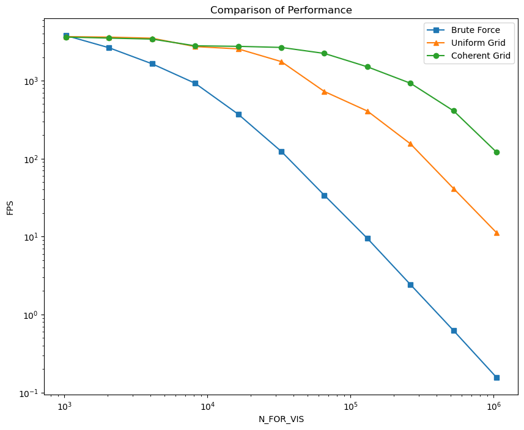

**University of Pennsylvania, CIS 565: GPU Programming and Architecture,
Project 1 - Flocking**

* Runze Wang
* Tested on: Windows 22, VS2019, CUDA12.2, RTX4060

This project is a CUDA implementation of Boid, an artificial life program that simulates fishes or birds’ flocking behaviors. The simulation is visualized by OpenGL.
<p align="center">
  
</p>

## Installation from Source

```sh
cmake -Bbuild .
cmake --build build --config Release
.\install\bin\Release\cis565_boids.exe -v
```

<details>
<summary><span style="font-weight: bold;">Command Line Arguments</span></summary>

  #### --save/ -s
  Flag to test num and fps, and save to files  (Default false)
  #### --vis/ -v
  Flag to visualize the simulation (Default false)
  #### --num/ -n
  Set the number of simulation
</details>
<br>

## Introduction: Flocking Simulation

Flocking is defined as the action of a crowd. In nature, flocking often happens on a crowd of birds or a school of fish. Birds, for example, often fly together as a whole in the sky, moving from one position to another. Although the shape of the crowd might change a lot, it is very amazing that each bird flies as if they knew the next steps of all other birds, so that it would never diverge from the crowd and they always stay together.

Biologists have been studying the behavior of flocking for a long time. In such context, we would also call each individual a **boid**. One might very easily start to wonder whether there is any type of communications taking place within the crowd so that they could maintain as a whole. Unfortunately, however, there is no such communication mechanism between each two individuals. In fact, according to the [notes from Conrad Parker](http://www.vergenet.net/~conrad/boids/), each individual would be able to stay close to other boids as long as they follow 3 simple rules:

1. Boids try to fly towards the center of mass of neighboring boids.
2. Boids try to keep a small distance away from other objects (including other boids).
3. Boids try to match velocity with near boids.

The objective of this project would be to build a flocking simulation using CUDA with these 3 simple rules. A demo of the final result has been showed right above this section.

## Algorithm: CUDA Acceleration

The simulation is based on  the **Reynolds Boids algorithm**, along with three levels of optimization. More details is in [INSTRUCTION](./INSTRUCTION.md). If you want to change the algorithm for flocking simulation, you need to set `UNIFORM_GRID` and `COHERENT_GRID` in [**src/main.cpp**](./src/main.cpp) .

<p align="center">
  
</p>

### Brute Force

- ping-pong buffers: **avoid read & write conflict and hide latency with the SIMT of CUDA.**
  - While one buffer provides output, the other buffer can be written asynchronously. 
  - Switch over when required.

### Uniform Grid

- uniform spatial grid: **avoid global loop for checking every other boid.**
  - Label every boid with an index key representing its enclosing cell.
  - Sort the key & value array.
  - Create the start & end array representing the border of the two different cells.
  - `thrust::sort_by_key`: sorting the value based on the key.

### Coherent Grid

- semi-coherent memory access: **spatial locality that lead load data to the warp chuck by chuck.**
  -  Rearranging the boid data so that all the velocities and positions of boids in one cell are also contiguous in memory. As the SM execute a warp, the data nearby will be loaded  at the same time.
  -  `thrust::gather`：rearranging  the data according to index buffer.


## Performance Analysis

**For each implementation, how does changing the number of boids affect performance? Why do you think this is?**

- The FPS would decrease as the number of boids increases. This is because GPU needs to compute more boid states and thus needs more threads to finish simulation per time step.

**For each implementation, how does changing the block count and block size affect performance? Why do you think this is?**

- In my experiment in FLOCKING, increasing the block count can improve performance up to a point.

  This is because each Streaming Multiprocessor (SM) in a GPU has a maximum number of blocks and threads it can handle simultaneously. If the block count exceeds this limit, the GPU must schedule the blocks, potentially reducing efficiency due to context switching and overhead.

  When considering a fixed number of boids, decreasing the block size leads to an increase in block count. Consequently, more boids can be processed in parallel across multiple blocks, enhancing performance.

- However, in other cases, the smaller block may also helpful to improve performance.

  - Shared memory and registers are limited resources per SM. Larger block sizes might require more resources per block, potentially limiting the number of concurrent blocks on an SM. This **trade-off** must be managed to ensure enough blocks can be resident to keep the GPU busy.
  - Occupancy is the ratio of active warps per SM to the maximum number of warps that the SM can support. Higher occupancy often leads to better performance, but it is not the only factor. The block size can impact occupancy; smaller block sizes might increase occupancy, but very small block sizes can lead to insufficient work per block.

**For the coherent uniform grid: did you experience any performance improvements with the more coherent uniform grid? Was this the outcome you expected? Why or why not?**

- The results show that the performance was improved with the aid of coherent grid. 
- This outcome was expected as GPU would pull out one chunk of memory at a time for a warp to access, and thus with coherent grid all threads in one warp would read the same chunk of data pulled out from GPU memory, thus reducing the memory I/O.

**Did changing cell width and checking 27 vs 8 neighboring cells affect performance? Why or why not?** 
